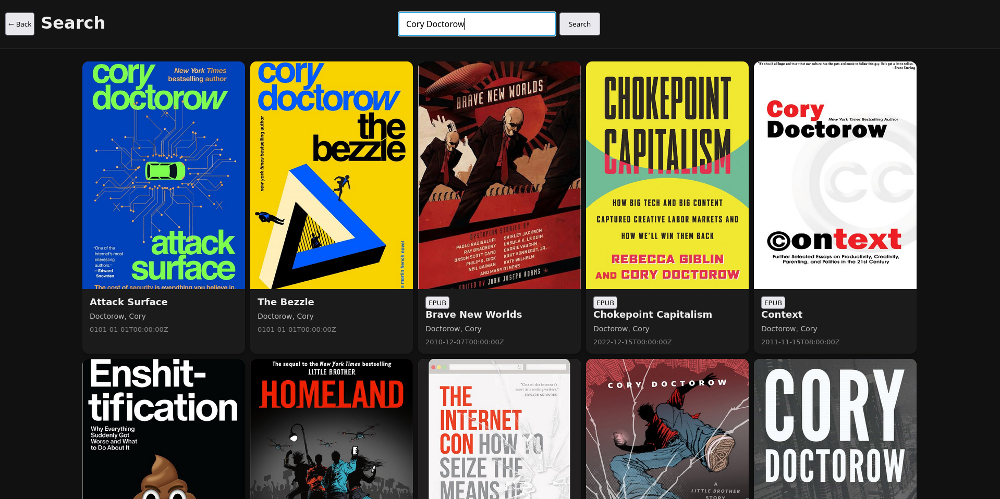
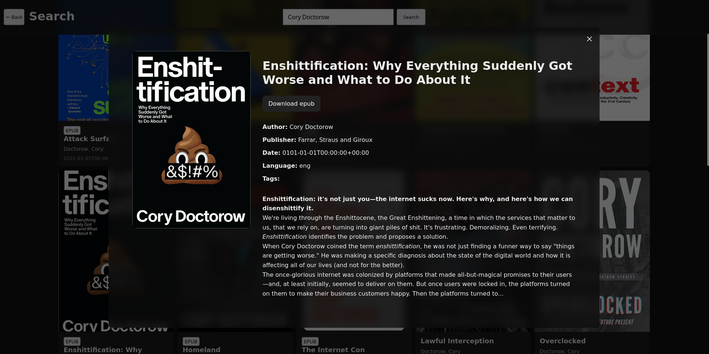

# CalibreFast

A fast, minimal web frontend for your [Calibre](https://calibre-ebook.com/) library.

> ⚠️ **Experimental.** CalibreFast is not feature complete and comes with no security guarantees. **Do not expose it to the public internet**. It is intended for personal use on a trusted local network (e.g. private wireguard/tailscale network).



---

## Is this AI Slop?

Perhaps. I have not used AI Agents directly and do audit/test much of the non-boilerplate code manually to meet my own personal standards for acceptable performance and stability, but I am using this project as a testbed for some AI-assisted development practices and have used multiple LLMs throughout development. 

Although I share many's distaste for generative AI usage (especially without due diligence) and acknowledge many valid ethical and environmental concerns with AI, I likely wouldn't have spent the time to build this project without it and it vastly speed up the prototyping process. 

As with any technology there is tradeoffs and it's very easy to accrue technical debt if you're not careful, skilled developers still have immense value!

- iotku

## What it is

CalibreFast is a personal project of mine, and I built it to scratch my own itch. I wanted a fast, simple way to browse my longstanding Calibre library without the slow performance of interfaces like Calibre-web or high resource usage of Booklore. 

CalibreFast reads directly from your Calibre `metadata.db` and serves your library as a snappy, paginated grid. Pages are pre-generated as static JSON at startup so browsing feels instant — no database round-trips while you scroll. Search hits the database directly with full title and author support.

- Paginated book grid with infinite scroll
- Fast cover thumbnails with lazy loading and a prefetch queue
- Search by title or author
- Download books in any format Calibre has (EPUB, PDF, MOBI, AZW3, DJVU)
- Book detail popup on click
- TODO: Keyboard and touch friendly (?)

## What it is not

- Not production ready
- Not authenticated or access controlled in any way (WARNING: currently upload endpoint is unauthenticated and allows anyone to upload files to your library)
- Not a full Calibre replacement or sync tool

## Getting started

### Prerequisites

- Go 1.21+
- A Calibre library with a `metadata.db`

### Run

```bash
git clone https://github.com/iotku/CalibreFast.git
cd CalibreFast
go run . -basedir /path/to/calibre/library -cachedir /path/to/cache
```

Then open [http://localhost:8080](http://localhost:8080).

### Flags

| Flag | Description |
|------|-------------|
| `-basedir` | Path to your Calibre library root (required) |
| `-cachedir` | Path to store generated cover thumbnails |

## How it works

On startup, CalibreFast queries `metadata.db` and writes paginated JSON files (`pages/page1.json`, `page2.json`, …) to disk. The frontend fetches these directly as static files — no database hit per page. Cover thumbnails are generated on first request and cached to disk.

Search is the one exception: it queries SQLite directly, joining the `books` and `authors` tables with a `LIKE` filter.

## Security

There is no authentication. Anyone who can reach the server can browse, upload to, and download your entire library. Run it on localhost or a private network only. You have been warned.

## License

MIT
